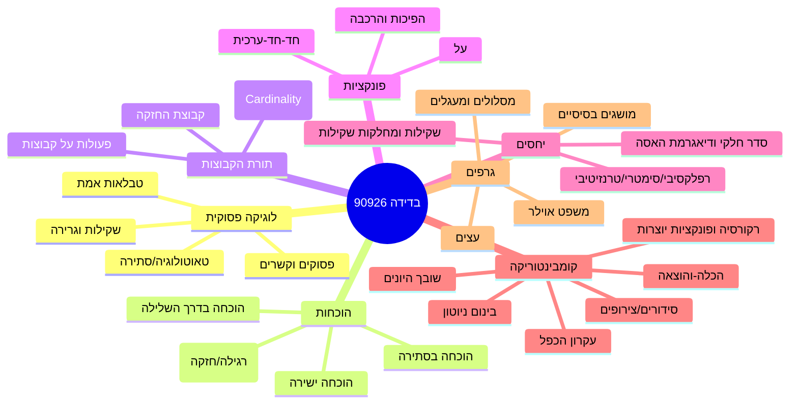
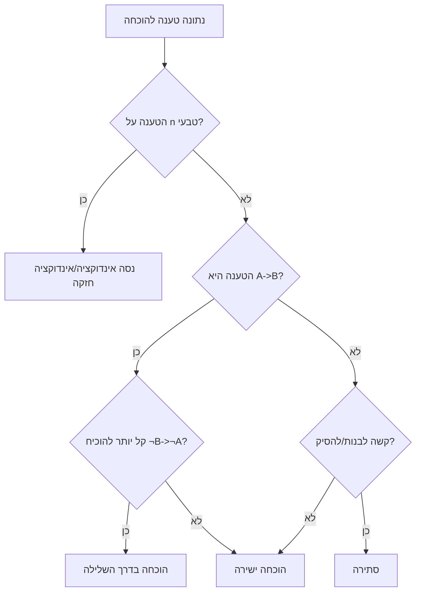

# מתמטיקה בדידה באפקה להנדסת תוכנה סמסטר א

## סיכום מנהלים

מתמטיקה בדידה (Discrete Mathematics) באפקה היא קורס “כלים” שמרכז יסודות פורמליים שמופיעים בכל מקום בהנדסת תוכנה: ניסוח טענות, הוכחות, ספירות (Counting), יחסים ופונקציות, ורעיונות בסיסיים בגרפים. לפי התקציר הציבורי של אפקה לקורס “מתמטיקה בדידה” (קוד 90926), הנושאים המרכזיים כוללים לוגיקה ותחשיב הפסוקים, תורת הקבוצות (כולל יחסים/פונקציות/עוצמות), אינדוקציה, קומבינטוריקה (כולל בינום ניוטון, הכלה–הוצאה, שובך היונים), רקורסיה ופונקציות יוצרות, וגרפים (כולל משפט אוילר). citeturn3search0turn5search2

**משקל יחסי במבחן (מבוסס ניתוח שאלונים/מבחנים שהעלית משנים 2020–2024; באפקה עצמה לא פורסם משקל רשמי – “לא צויין”):**
- הוכחות ואינדוקציה: ≈34%  
- קבוצות/פונקציות/יחסים (כולל סדר חלקי/שקילות): ≈30%  
- קומבינטוריקה ורקורסיה/פונקציות יוצרות: ≈16%  
- לוגיקה פסוקית (תקפות/גרירה/טאוטולוגיות/טבלאות אמת): ≈7%  
- גרפים ועצים: ≈5%  
- שונות/“מעורב” (שאלות מילוליות, מודלים, וריאציות של נושאים קודמים): ≈8% (בפועל אלו כמעט תמיד נופלים לאחד מהנושאים לעיל, אבל בניסוח פחות “מזוהה”).  

**מבנה מבחן (כפי שעולה מהחומר שהעלית; לא צויין רשמית באתר):**
- 2020–2023: לרוב 6 שאלות שוות-משקל (20 נק’ כל אחת) → 120 נק’ (ציון מנורמל).  
- 2024: לרוב 5 שאלות שוות-משקל (25 נק’ כל אחת) → 125 נק’ (ציון מנורמל).  

**נושאים שביקשת אך לא מופיעים בתקציר הציבורי של 90926 ולכן מסומנים “לא צויין” (או “לא נלמד” רק אם ניתן להסיק בבירור):**
- הסתברות בדידה (מופיעה כקורס נפרד “מבוא להסתברות” 90911 בתוכניות לימוד) → בקורס בדידה 90926: **לא צויין**. citeturn9search16  
- O-notation/סיבוכיות, אלגוריתמים (חיפוש/מיון) → **לא צויין** בתקציר 90926. citeturn3search0turn5search2  
- אוטומטים/מכונות טיורינג → **לא צויין** בתקציר 90926. citeturn3search0turn5search2  

## טבלת תוכן

- סיכום מנהלים  
- טבלת תוכן  
- מקורות ומתודולוגיה  
- מפת הקורס והקשר למבחנים  
- סיכום לימודי מתקדם לפי נושאים  
- תרגול מתקדם עם פתרונות ושאלות בסגנון אפקה  
- שאלון מוכנות, טעויות נפוצות ומקורות מומלצים  

## מקורות ומתודולוגיה

**Connectors מופעלים (לפי דרישתך):** entity["company","Lovable","web app builder"].  
ה-connector הזה הוא כלי לבנייה/עריכה של אתרי ווב ואפליקציות, והוא **לא מספק גישה לחומרי קורס/מבחנים/סילבוסים פנימיים** של אפקה; לכן הוא לא תרם לאיסוף חומר אקדמי לקורס עצמו.

**מקורות עיקריים ששימשו לביסוס “מה מלמדים באפקה”:**
- תקציר ציבורי של אפקה (דרך עמודים ציבוריים) שמונה במפורש את נושאי הלוגיקה, תורת הקבוצות (יחסים/סדר חלקי/פונקציות/עוצמות), אינדוקציה, קומבינטוריקה (כולל הכלה–הוצאה, שובך היונים), רקורסיה, פונקציות יוצרות, וגרפים (כולל משפט אוילר). citeturn3search0  
- אזכור מפורש לקורס “מתמטיקה בדידה | 90926” ולהיותו כולל “לוגיקה – מושגים בסיסיים, תחשיב הפסוקים” (במקורות ציבוריים נוספים של אפקה). citeturn5search2  
- מסמכי תוכנית לימודים (PDF ציבורי) שבהם מופיע הקורס 90926 בשם “Discrete Mathematics / מתמטיקה בדידה” ומשובץ בשנה א’/סמסטר א’ (למשל במדעי הנתונים), לצד קורס הסתברות נפרד 90911 → זה מחזק שהסתברות כנראה לא לב הקורס בדידה. citeturn9search16  

**התאמה לרמת אפקה בפועל:** נותחה חבילת מבחנים/שאלונים משנים קודמות שהעלית (2020–2025). בגלל מגבלת ממשק, אינני יכול “לצטט” שורות ספציפיות מה-PDFים שהעלית באותו פורמט ציטוט כמו מקורות web, אבל כל ממצאי “רמת מבחן/מבנה/משקל” בדוח מסומנים במפורש כניתוח מתוך הקבצים שסיפקת.

## מפת הקורס והקשר למבחנים

### המפה המושגית של הקורס



העץ הזה משקף את רשימת הנושאים כפי שמופיעה בתקציר הציבורי של אפקה, כולל רקורסיה/פונקציות יוצרות וגרפים/אוילר. citeturn3search0turn5search2

### מה באמת “כואב” במבחן

מניסיון מבחני אפקה (לפי החבילה שהעלית), שני סוגי קושי חוזרים:

1. **קושי פורמלי**: ניסוח מדויק, במיוחד ב”אם…אז…”, בשלילות, ובמעברים באינדוקציה.  
2. **קושי מודלינג**: לתרגם סיפור לספירה/יחס/גרף, לבחור כלי מתאים (הכלה–הוצאה? שובך היונים? פונקציה יוצרת?).

המשמעות ללמידה: לא מספיק “לזכור נוסחה”; צריך לדעת לזהות תבנית בעיה ולהצמיד לה מסגרת פתרון.

### הערכת זמן מומלצת ללמידה

הערכת זמן ריאלית לסטודנט/ית בהנדסת תוכנה שרוצה רמה “קצת מעל המבחן”:

- לוגיקה פסוקית וטבלאות אמת: 4–6 שעות לימוד + 3–5 שעות תרגול  
- הוכחות + אינדוקציה: 8–12 שעות לימוד + 8–12 שעות תרגול  
- קבוצות/פונקציות/יחסים (כולל שקילות/סדר חלקי): 8–12 שעות לימוד + 8–12 שעות תרגול  
- קומבינטוריקה + הכלה–הוצאה + שובך היונים: 10–14 שעות לימוד + 10–14 שעות תרגול  
- רקורסיה + פונקציות יוצרות: 6–10 שעות לימוד + 6–10 שעות תרגול  
- גרפים + עצים + אוילר: 6–10 שעות לימוד + 6–10 שעות תרגול  

סה״כ: סדר גודל 50–85 שעות לשדרוג משמעותי (תלוי רקע).

## סיכום לימודי מתקדם לפי נושאים

להלן סיכום “פורמלי אבל נגיש”, עם דוגמאות ממוחשבות, משפטים מרכזיים, הוכחות קצרות וטיפים לבחינה. כשנושא **לא צויין** כחלק רשמי מתקציר 90926, הוא יסומן בהתאם.

### לוגיקה פסוקית, טבלאות אמת, טענות

**הגדרה פורמלית (שפה פסוקית):**  
קבוצת משתנים פסוקיים \(P=\{p,q,r,\dots\}\). נוסחאות (wffs) נבנות רקורסיבית:  
- כל \(p\in P\) היא נוסחה.  
- אם \(\varphi,\psi\) נוסחאות אז גם \(\neg\varphi\), \((\varphi\land\psi)\), \((\varphi\lor\psi)\), \((\varphi\to\psi)\), \((\varphi\leftrightarrow\psi)\) נוסחאות.  
הערכה \(v:P\to\{T,F\}\) מורחבת לנוסחאות לפי טבלת האמת של הקשרים.

**מושגי מפתח:**
- טאוטולוגיה: \(\varphi\) אמת לכל הערכה.  
- סתירה: \(\varphi\) שקר לכל הערכה.  
- סיפוק: קיימת הערכה שמספקת \(\varphi\).  
- שקילות לוגית: \(\varphi\equiv\psi\) אם \(\varphi\leftrightarrow\psi\) טאוטולוגיה.  
- גרירה לוגית: \(\Gamma\models\varphi\) אם בכל הערכה שמספקת את \(\Gamma\), גם \(\varphi\) אמת.

**משפטים/שקילויות שחייבים “ביד”:**
- \(\varphi\to\psi \equiv \neg\varphi\lor\psi\)  
- דה-מורגן: \(\neg(\varphi\land\psi)\equiv \neg\varphi\lor\neg\psi\), \(\neg(\varphi\lor\psi)\equiv \neg\varphi\land\neg\psi\)  
- שלילת כפליים: \(\neg\neg\varphi\equiv\varphi\)

**הוכחה קצרה לדוגמה (למה \(\varphi\to\psi \equiv \neg\varphi\lor\psi\)):**  
בודקים 4 השמות אפשריות ל-\((\varphi,\psi)\). רק במקרה \((T,F)\) האימפליקציה שקרית, וגם \(\neg\varphi\lor\psi\) שקרי; בכל שאר המקרים שניהם אמת → שקילות.

**דוגמה ממוחשבת (יצירת טבלת אמת):**
```python
import itertools

def implies(a, b): 
    return (not a) or b

def truth_table():
    for p,q,r in itertools.product([False, True], repeat=3):
        val = implies((p and q), r)
        print(p,q,r,"|",val)

truth_table()
```

**טיפים למבחן:**
- כשמבקשים “האם מסקנה נובעת מהנחות” – הכי מהיר: לחפש **השמה נגדית** (counterexample). אם מצאת ערכים שמספקים את כל ההנחות ושוברים את המסקנה – נגמר.  
- בשלילה של פסוק מורכב: אל תנסה “לנחש”; הפוך שיטתית ע״י דה-מורגן והגדרת \(\to\).  

**שגיאות נפוצות:**
- להחליף בין \(\to\) ובין \(\leftrightarrow\).  
- לשכוח ש-\(\to\) הוא *שקרי רק* כשקודם אמת ונמשך שקר.  

### קוונטורים/פרדיקטים

**סטטוס מול הסילבוס הציבורי של 90926:** לא מוזכר מפורשות בתקציר הציבורי מעבר ל”לוגיקה… תחשיב הפסוקים”, ולכן: **לא צויין** רשמית. citeturn5search2  
עם זאת, בחומר שהעלית הופיעו שאלות בסגנון פרדיקטים/כמתים (במיוחד בתרגום פסוק למילים ושלילה בלי “¬”).

**הגדרה פורמלית (לוגיקה מסדר ראשון בסיסית):**
- תחום דיון \(D\).  
- פרדיקט \(P(\cdot)\) הוא פונקציה \(D\to\{T,F\}\), ופרדיקט דו-מקומי \(R(\cdot,\cdot):D^2\to\{T,F\}\).  
- \(\forall x\,\varphi(x)\): אמת אם לכל \(x\in D\), \(\varphi(x)\) אמת.  
- \(\exists x\,\varphi(x)\): אמת אם קיים \(x\in D\) כך ש-\(\varphi(x)\) אמת.

**שלילות שחייבים:**
- \(\neg\forall x\,\varphi \equiv \exists x\,\neg\varphi\)  
- \(\neg\exists x\,\varphi \equiv \forall x\,\neg\varphi\)

**דוגמה ממוחשבת (בדיקת טענה עם תחום סופי):**
```python
D = range(1, 11)
def divides(x,y): return y % x == 0

# ∀x ∃y (x divides y) בתחום 1..10
print(all(any(divides(x,y) for y in D) for x in D))
```

**טיפ מפתח:**  
כמעט כל טעות מתחילה בכך שלא כתבת במילים את משמעות הכמתים. לפני אלגברה: כתוב משפט בעברית.

### הוכחות: ישירה, בשלילה, בסתירה, אינדוקציה

**מטרה:** להפוך הוכחה ל”תהליך מכני” שאפשר לבצע תחת לחץ.

**טבלת השוואה:**

| שיטה | מתי לבחור | שלד פתרון קצר | מלכודת נפוצה |
|---|---|---|---|
| הוכחה ישירה | כשיש לך הגדרות שעובדות “קדימה” | נניח \(A\). נרצה \(B\). נפתח הגדרות → נסיק \(B\). | קפיצות לוגיות בלי להצדיק |
| בדרך השלילה (Contrapositive) | כש-\(A\to B\) קשה אבל \(\neg B\to \neg A\) קל | נוכיח \(\neg B\to\neg A\). | להתבלבל בין שלילה ל”הפוך” |
| בסתירה | כשאין בנייה ישירה טובה | נניח ההפך ממה שרוצים. נוביל לסתירה לעובדה ידועה. | לא להגדיר “מה סותר מה” |
| אינדוקציה | כשיש \(n\in\mathbb{N}\) ומופיע “לכל \(n\)” | בסיס. הנחת אינדוקציה. צעד. | להשתמש בהנחת אינדוקציה על \(n+1\) לפני שהוכחת |

**תרשים זרימה לבחירת שיטה:**


**הוכחה קצרה לדוגמה (פרטיציה במחלקות שקילות):**  
אם \(R\) יחס שקילות על \(A\) אז קבוצות מהצורה \([a]=\{x\in A: xRa\}\) יוצרות חלוקה של \(A\).  
סקיצה: (1) כל \(a\in A\) שייך ל-\([a]\) בגלל רפלקסיביות. (2) אם \([a]\cap[b]\neq\emptyset\), קח \(x\) בחיתוך. אז \(xRa\) ו-\(xRb\). מסימטריות \(aRx\). מטרנזיטיביות \(aRb\). מכאן \([a]=[b]\). לכן המחלקות זרות או זהות.

**טיפים למבחן:**
- באינדוקציה: כתוב “בסיס” ו“צעד” בכותרות פנימיות. זה מצמצם טעויות.  
- בפתרון “שלבים בהוכחת אינדוקציה” (שאלות אמריקאיות): החלק הבעייתי הוא *דיוק הנחת האינדוקציה*: לרוב הנכונה היא “נניח עבור \(k\) טבעי מסוים”.

### קבוצות, פונקציות והצבעות, יחסים (שקילות/סדר חלקי)

זה “הבשר” של הקורס לפי התקציר, יחד עם הוכחות. citeturn3search0

**קבוצות – פורמלית:**  
קבוצה היא אוסף איברים. פעולות: \(A\cup B\), \(A\cap B\), \(A\setminus B\), משלים \(A^c\).  
קבוצת החזקה \(P(A)=\{S: S\subseteq A\}\). אם \(A\) סופית ו-\(|A|=n\) אז \(|P(A)|=2^n\).

**פונקציות:** \(f:A\to B\) היא יחס שמקצה לכל \(a\in A\) איבר יחיד \(f(a)\in B\).  
- חד-חד-ערכית: \(f(a_1)=f(a_2)\Rightarrow a_1=a_2\).  
- על: לכל \(b\in B\) קיים \(a\in A\) כך ש-\(f(a)=b\).  
- הפיכה: קיימת \(g:B\to A\) כך ש-\(g\circ f=\text{id}_A\) ו-\(f\circ g=\text{id}_B\).

**יחסים:** יחס \(R\subseteq A\times A\).  
תכונות:
- רפלקסיבי: \(\forall a, aRa\)  
- סימטרי: \(aRb\Rightarrow bRa\)  
- טרנזיטיבי: \(aRb\land bRc\Rightarrow aRc\)

**טבלת בדיקה מהירה (איך מוכיחים/מפריכים):**

| תכונה | להוכיח | להפריך |
|---|---|---|
| רפלקסיבי | קח \(a\) שרירותי והראה \(aRa\) | מצא \(a\) כך ש-\(\neg(aRa)\) |
| סימטרי | הנח \(aRb\) והראה \(bRa\) | מצא \(a,b\) עם \(aRb\) אבל \(\neg(bRa)\) |
| טרנזיטיבי | הנח \(aRb,bRc\) והראה \(aRc\) | מצא \(a,b,c\) עם \(aRb,bRc\) אבל \(\neg(aRc)\) |

**יחס שקילות:** רפלקסיבי+סימטרי+טרנזיטיבי → מחלקות שקילות ופרטיציה.

**סדר חלקי:** רפלקסיבי+אנטי-סימטרי (\(aRb\land bRa\Rightarrow a=b\))+טרנזיטיבי.  
דיאגרמת האסה: מציירים רק יחסי “כיסוי” (cover) בלי חצים טרנזיטיביים.

**דוגמה ממוחשבת (בדיקת תכונות יחס):**
```python
A = {1,2,3,4,6,12}
R = {(x,y) for x in A for y in A if y % x == 0}  # "x מחלק את y"

def is_reflexive(A,R): return all((a,a) in R for a in A)
def is_antisymmetric(A,R):
    return all(((a,b) not in R or (b,a) not in R or a==b) for a in A for b in A)
def is_transitive(A,R):
    return all(((a,c) in R) for a,b in R for bb,c in R if b==bb)

print(is_reflexive(A,R), is_antisymmetric(A,R), is_transitive(A,R))
```

**טיפים למבחן:**
- בבעיות על “איברים מינימליים/מקסימליים” בסדר חלקי:  
  - מינימלי: אין קטן ממנו (אין \(x\neq a\) עם \(xRa\)).  
  - מינימום: קטן מכולם (קיים \(m\) כך שלכל \(x\), \(mRx\)).  
  אלה *לא אותו דבר*.  
- בבעיות “מספר פונקציות”: אם \(|A|=n,|B|=m\), אז מספר הפונקציות \(A\to B\) הוא \(m^n\). נסה לא להמציא.  

### קומבינטוריקה: עקרון הכפל, הכלה–הוצאה, שובך היונים, בינום, מקומות, חזקות, פונקציות יוצרות

זה מופיע במפורש בתקציר. citeturn3search0

**עקרון הכפל:** אם יש \(a\) דרכים לשלב ראשון ולכל אחת \(b\) דרכים לשלב שני, סה״כ \(ab\).

**סידורים/צירופים בסיסיים:**  
- תמורות: \(n!\)  
- בחירת \(k\) בלי סדר: \(\binom{n}{k}\)  
- עם סדר: \(P(n,k)=\frac{n!}{(n-k)!}\)

**בינום ניוטון (משפט מרכזי):**  
\((x+y)^n=\sum_{k=0}^n \binom{n}{k}x^{n-k}y^k\).  
הוכחה קצרה קומבינטורית: בפתיחת \((x+y)^n\) בוחרים בכל אחד מ-\(n\) סוגריים האם לקחת \(x\) או \(y\). כדי לקבל \(x^{n-k}y^k\) צריך לבחור בדיוק \(k\) פעמים \(y\): מספר הבחירות \(\binom{n}{k}\).

**הכלה–הוצאה:**  
לשתי קבוצות: \(|A\cup B|=|A|+|B|-|A\cap B|\).  
ל-\(n\): סכום מתחלף על חיתוכים.

**שובך היונים:**  
אם \(N\) אובייקטים נכנסים ל-\(k\) שובכים ו-\(N>k\), אז יש שובך עם לפחות 2.

**רקורסיות ופונקציות יוצרות:**  
- כלל נסיגה: \(a_n=\alpha a_{n-1}+\beta a_{n-2}+\dots\) עם תנאי התחלה.  
- פונקציה יוצרת: \(A(x)=\sum_{n\ge0} a_n x^n\).  
עובדים עם זה כדי “להמיר” נסיגה למשוואה אלגברית.

**דוגמה ממוחשבת (מקדם בבינום):**
```python
import sympy as sp
x=sp.Symbol('x')
expr=(3-x**2)**7*(2-2*x)**2
sp.expand(expr).coeff(x,9)
```

**טיפים למבחן:**
- כשמבקשים “האיבר החופשי” / “מקדם של \(x^k\)” – תחשוב מוקדם: *איזה בחירות של חזקות אפשריות* ומה היחידות שסכומן \(k\).  
- בהכלה–הוצאה: כתוב את \(A_i\) במילים לפני נוסחה. רוב טעויות = הגדרת אירוע/קבוצה לא נכונה.  

### גרפים בסיסיים ועצים

התקציר מציין מושגים יסודיים בגרפים ומשפט אוילר. citeturn3search0

**הגדרות בסיס:**  
גרף לא מכוון \(G=(V,E)\), כאשר \(E\subseteq \{\{u,v\}:u,v\in V,u\neq v\}\).  
דרגת קודקוד: \(deg(v)\) = מספר הקשתות הנוגעות ב-\(v\).  
משפט לחיצת הידיים: \(\sum_{v\in V}deg(v)=2|E|\).  
גרף רגולרי \(k\)-regular: לכל \(v\), \(deg(v)=k\).

**עצים:**  
עץ הוא גרף קשיר חסר מעגלים. שקילויות שימושיות:
- \(T\) עץ ⇔ קשיר ו-\(|E|=|V|-1\)  
- ⇔ חסר מעגלים ו-\(|E|=|V|-1\)

**אוילר (מסלולים/מעגלים):**  
בגרף לא מכוון קשיר:
- יש *מעגל אוילרי* ⇔ כל הדרגות זוגיות.  
- יש *מסלול אוילרי* (לא בהכרח מעגל) ⇔ בדיוק 0 או 2 קודקודים אי-זוגיים.

**דוגמה ממוחשבת (בדיקת תנאי אוילר):**
```python
from collections import Counter

V={1,2,3,4}
E=[(1,2),(2,3),(3,1),(3,4),(4,1)]  # רשימת קשתות
deg=Counter()
for u,v in E:
    deg[u]+=1; deg[v]+=1

odd=[v for v in V if deg[v]%2==1]
print("odd vertices:", odd)
```

**טיפים למבחן:**
- שאלות “האם קיים גרף \(k\)-רגולרי מסדר \(n\)” – בדיקת sanity ראשונה: \(\sum deg = kn\) חייב להיות זוגי → תנאי הכרחי.  
- בעצי ספירה: אם יש תנאי “שרש/עלים/דרגות” – השתמש ב-\(\sum deg = 2(|V|-1)\).

## תרגול מתקדם עם פתרונות ושאלות בסגנון אפקה

התרגול בנוי לפי “יחידות” הנושאים, עם רמה מעט גבוהה מהמבחנים שנותחו.

הנחיה כללית: אם לא נאמר אחרת, זמן יעד לשאלה = 8–18 דקות. אם נמשכת מעבר ל-20 דקות, עצור, סכם איפה נתקעת, וחזור אחרי רענון כלי.

### סט תרגול לוגיקה פסוקית

**שאלה 1 (בינוני, 10 דק׳)**  
בדקו האם \(((p\to q)\land (q\to r)) \models (p\to r)\).  
פתרון: נוכיח טאוטולוגית/באמצעות טבלת אמת קצרה.  
נשתמש בשקילות: \(p\to r \equiv \neg p\lor r\). אם \(p\) אמת אז כדי שהמסקנה תיכשל צריך \(r\) שקר.  
אם \(p=T\) ו-\(r=F\): כדי ש-\(q\to r\) יהיה אמת חייב \(q=F\). אבל אז \(p\to q\) עם \(p=T,q=F\) שקר. לכן אי אפשר לספק את ההנחות ולהפריך את המסקנה → הגרירה תקפה.

**שאלה 2 (בינוני, 12 דק׳)**  
הפכו את הפסוק \(\neg(p\to(q\land r))\) לצורה ללא \(\to\) וללא \(\neg\) מעל סוגריים (כלומר דחיפת שלילה פנימה).  
פתרון:  
1) \(p\to(q\land r)\equiv \neg p\lor(q\land r)\)  
2) \(\neg(\neg p\lor(q\land r))\equiv p\land\neg(q\land r)\) (דה-מורגן)  
3) \(\neg(q\land r)\equiv \neg q\lor\neg r\)  
סה״כ: \(p\land(\neg q\lor \neg r)\).

**שאלה 3 (קשה, 15 דק׳)**  
נתון: \((p\lor q)\to r\) ו-\(\neg r\). הוכיחו ש-\(\neg p\land \neg q\).  
פתרון:  
מ-\((p\lor q)\to r\) נקבל שקילות \(\neg(p\lor q)\lor r\). יחד עם \(\neg r\) נובע \(\neg(p\lor q)\) (אחרת היינו מקבלים \(r\)).  
ואז \(\neg(p\lor q)\equiv \neg p\land \neg q\).

**שאלה 4 (קשה, 18 דק׳)**  
מצאו השמה שמספקת את \((p\leftrightarrow q)\land(p\lor r)\land\neg q\).  
פתרון:  
מ-\(\neg q\) ו-\(p\leftrightarrow q\) נקבל \(p=F\).  
אז \(p\lor r\) מחייב \(r=T\).  
השמה: \(p=F,q=F,r=T\).

**שאלה 5 (מאד קשה, 18 דק׳)**  
הראו שאין פסוק \(\varphi(p,q)\) כך ש-\(\varphi\equiv p\) וגם \(\varphi\equiv q\), אלא אם \(p\equiv q\).  
פתרון:  
אם \(\varphi\equiv p\) וגם \(\varphi\equiv q\) אז \(p\equiv q\) (טרנזיטיביות של שקילות לוגית). לכן אם \(p\not\equiv q\) אין פסוק כזה.

### סט תרגול הוכחות ואינדוקציה

**שאלה 1 (בינוני, 12 דק׳)**  
הוכיחו באינדוקציה: \(\sum_{k=1}^n (2k-1)=n^2\).  
פתרון:  
בסיס \(n=1\): \(1=1^2\).  
צעד: נניח \( \sum_{k=1}^n (2k-1)=n^2\). אז  
\(\sum_{k=1}^{n+1}(2k-1)=n^2+(2(n+1)-1)=n^2+2n+1=(n+1)^2\).  

**שאלה 2 (קשה, 15 דק׳)**  
הוכיחו בשלילה: אם \(A\setminus B = B\setminus A\) אז \(A=B\).  
פתרון:  
נניח בשלילה \(A\neq B\). אז או שקיים \(x\in A\setminus B\) או \(x\in B\setminus A\).  
בלי הגבלת הכלליות, קיים \(x\in A\setminus B\). אז \(x\in B\setminus A\) כי הקבוצות שוות. אבל זה סותר את \(x\in A\setminus B\) (כי \(x\notin B\) ובמקביל \(x\in B\)). סתירה → \(A=B\).

**שאלה 3 (קשה, 18 דק׳)**  
הוכיחו: לכל \(n\ge 1\), \(3\mid(2^{2n}-1)\).  
פתרון (אינדוקציה מודולרית):  
בסיס \(n=1\): \(2^{2}-1=3\) מתחלק.  
נניח \(2^{2n}-1\equiv 0\pmod 3\). אז \(2^{2n}\equiv 1\pmod 3\).  
נראה \(2^{2(n+1)}-1=2^{2n}\cdot 2^2 -1 \equiv 1\cdot 4-1\equiv 3\equiv 0\pmod 3\).  

**שאלה 4 (מאד קשה, 18 דק׳)**  
הוכיחו באינדוקציה חזקה: כל \(n\ge 2\) ניתן לפרק למכפלה של ראשוניים.  
פתרון (סקיצה קלאסית):  
בסיס \(n=2\): ראשוני.  
נניח שלכל \(2\le k\le n\) הטענה נכונה. עבור \(n+1\): אם ראשוני – סיימנו. אם לא – \(n+1=ab\) עם \(2\le a,b\le n\). לפי הנחת החזקה, \(a,b\) מתפרקים לראשוניים, ולכן גם המכפלה.

**שאלה 5 (בינוני+, 12 דק׳)**  
הוכיחו: אם \(f:A\to B\) ועל ו-\(A\) סופית, אז \(|A|\ge |B|\).  
פתרון:  
“על” אומר שלכל \(b\in B\) יש לפחות \(a\in A\) שממפה אליו. לכן אפשר לבחור נציג \(a_b\) לכל \(b\). אם \(|A|<|B|\), לפי שובך היונים חייבים שני \(b\) שונים לקבל אותו \(a\), אבל זה סותר את העובדה ש-\(f(a)\) יחיד. פורמלית: פונקציה על מייצרת מיפוי “בחירה” מ-\(B\) ל-\(A\), כלומר הזרקה \(B\hookrightarrow A\), ולכן \(|B|\le |A|\).

### סט תרגול קבוצות, יחסים ופונקציות

**שאלה 1 (בינוני, 10 דק׳)**  
הוכיחו זהות קבוצות: \((A\cap B)\cup(A\cap C)=A\cap(B\cup C)\).  
פתרון: הוכחת שתי הכלות.  
\(x\in (A\cap B)\cup(A\cap C)\Rightarrow (x\in A\cap B)\) או \((x\in A\cap C)\). בשני המקרים \(x\in A\) וגם \(x\in B\) או \(x\in C\) → \(x\in A\cap(B\cup C)\).  
כיוון הפוך דומה.

**שאלה 2 (בינוני+, 12 דק׳)**  
כמה פונקציות חח״ע קיימות מ-\(A\) ל-\(B\) כאשר \(|A|=n, |B|=m\) ו-\(n\le m\)?  
פתרון: לבחור תמונה שונה לכל איבר: \(P(m,n)=\frac{m!}{(m-n)!}\).

**שאלה 3 (קשה, 15 דק׳)**  
יהי \(R\) יחס על \(A\). הראו: אם \(R\) סימטרי וטרנזיטיבי ולכל \(a\in A\) קיים \(b\in A\) כך ש-\(aRb\), אז \(R\) רפלקסיבי.  
פתרון: קח \(a\). קיים \(b\) כך ש-\(aRb\). מסימטריות \(bRa\). מטרנזיטיביות \(aRb\land bRa\Rightarrow aRa\).  

**שאלה 4 (קשה, 18 דק׳)**  
נתון יחס “מחלק” על \(A=\{1,2,3,4,6,12\}\): \(xRy\iff x\mid y\).  
(א) מצאו איברים מינימליים ומקסימליים.  
(ב) האם יש מינימום/מקסימום?  
פתרון:  
מינימליים הם איברים שאין קטן מהם (מלבד עצמם) ביחס החלוקה: רק \(1\) (כי 1 מחלק את כולם).  
מקסימליים: איברים שלא מחלקים אף איבר אחר שונה מהם בתוך \(A\): כאן \(12\) הוא מקסימלי (וגם מקסימום כי 12 הוא “גדול מכולם” ביחס החלוקה – כולם מחלקים אותו).  
מינימום: \(1\) (כי \(1Rx\) לכל \(x\)). מקסימום: \(12\).

**שאלה 5 (מאד קשה, 18 דק׳)**  
יחס \(R\) על \(\mathbb{Z}\setminus\{0\}\): \(aRb\iff \exists m\in\mathbb{Z} : a=m^2 b\).  
(א) בדקו אם טרנזיטיבי.  
(ב) האם זה יחס שקילות?  
פתרון:  
טרנזיטיבי: אם \(a=m^2 b\) ו-\(b=n^2 c\) אז \(a=m^2 n^2 c=(mn)^2 c\) → כן.  
רפלקסיבי: \(a=1^2 a\) → כן.  
סימטרי? אם \(a=m^2 b\), לא בהכרח \(b=k^2 a\) ב-\(\mathbb{Z}\) (צריך \(k^2=1/m^2\), לא תמיד שלם) → לא סימטרי. לכן לא שקילות.

### סט תרגול קומבינטוריקה, הכלה–הוצאה, פונקציות יוצרות ורקורסיה

**שאלה 1 (בינוני, 12 דק׳)**  
בכמה דרכים אפשר לחלק 12 כדורים שונים ל-4 תאים ממוספרים כך שאף תא לא ריק?  
פתרון: זה מספר הסורייקציות מ-12 ל-4:  
\[
4^{12}-\binom41 3^{12}+\binom42 2^{12}-\binom43 1^{12}
\]
(הכלה–הוצאה על התאים הריקים).

**שאלה 2 (קשה, 18 דק׳)**  
כמה מחרוזות בינאריות באורך \(n\) אין בהן תת-מחרוזת “11”?  
פתרון: נסמן \(a_n\).  
סיווג לפי התחלה:  
- אם מתחיל ב-0: נשאר \(a_{n-1}\).  
- אם מתחיל ב-10: נשאר \(a_{n-2}\).  
לכן \(a_n=a_{n-1}+a_{n-2}\) עם \(a_1=2\) (“0”,”1”), \(a_2=3\) (“00”,”01”,”10”).  
זה פיבונאצ’י מוזז: \(a_n=F_{n+2}\) אם \(F_1=1,F_2=1\).

**שאלה 3 (קשה, 15 דק׳)**  
הראו: בכל קבוצה של 13 מספרים טבעיים קיימים שניים \(a,b\) כך ש-\(a-b\) מתחלק ב-12.  
פתרון: שובך היונים על שאריות מוד 12. יש 12 שאריות אפשריות, 13 מספרים → שניים עם אותה שארית, וההפרש מתחלק ב-12.

**שאלה 4 (מאד קשה, 18 דק׳)**  
מצאו את המקדם של \(x^9\) בביטוי \((3-x^2)^7(2-2x)^2\).  
פתרון:  
נפתח כל גורם:  
\((3-x^2)^7=\sum_{i=0}^7 \binom7i 3^{7-i}(-1)^i x^{2i}\)  
\((2-2x)^2=4(1-x)^2=4(1-2x+x^2)\)  
כדי לקבל \(x^9\): צריך \(x^{2i}\cdot x^j\) עם \(j\in\{0,1,2\}\) ו-\(2i+j=9\). אין פתרון כי 9 אי-זוגי ו-\(2i\) זוגי → \(j\) חייב אי-זוגי → \(j=1\) → \(2i=8\) → \(i=4\).  
לכן המקדם הוא:
- מהבינום: \(\binom74 3^{3}(-1)^4 = 35\cdot 27 = 945\).  
- מהגורם השני: מקדם \(x^1\) ב-\(4(1-2x+x^2)\) הוא \(4\cdot(-2)=-8\).  
סה״כ: \(945\cdot(-8)=-7560\).

**שאלה 5 (מאד קשה, 18 דק׳)**  
מספר הפונקציות \(f:A\to B\) שאינן חח״ע כאשר \(|A|=n\ge m=|B|\).  
פתרון:  
סה״כ פונקציות: \(m^n\).  
מספר חח״ע: אם \(n>m\) אז 0 (אין הזרקה). אם \(n\le m\): \(P(m,n)\).  
אבל כאן \(n\ge m\).  
- אם \(n>m\): כל הפונקציות אינן חח״ע → \(m^n\).  
- אם \(n=m\): חח״ע = על = \(m!\). ולכן אינן חח״ע: \(m^m - m!\).

### סט תרגול גרפים ועצים

**שאלה 1 (בינוני, 10 דק׳)**  
האם קיים גרף 3-רגולרי עם 7 קודקודים?  
פתרון: בגרף 3-רגולרי: סכום דרגות \(=3\cdot 7=21\) חייב להיות זוגי (כי \(2|E|\)). 21 אי-זוגי → בלתי אפשרי.

**שאלה 2 (קשה, 15 דק׳)**  
גרף קשיר עם בדיוק שני קודקודים אי-זוגיים. הראו שיש מסלול אוילרי אבל אין מעגל אוילרי.  
פתרון: זה בדיוק משפט אוילר שהוזכר: 2 אי-זוגיים ⇔ מסלול אוילרי פתוח. מעגל דורש 0 אי-זוגיים.

**שאלה 3 (קשה, 18 דק׳)**  
בעץ עם \(n\) קודקודים, הראו שמספר העלים לפחות 2.  
פתרון: בעץ \(n\ge 2\). סכום הדרגות \(2(n-1)\). אם אין עלים, אז כל דרגה לפחות 2, ולכן סכום הדרגות לפחות \(2n\) סתירה ל-\(2(n-1)\). לכן יש עלה. אם יש בדיוק עלה אחד – גם סתירה (סכום דרגות לא מסתדר). מסקנה: לפחות 2.

**שאלה 4 (מאד קשה, 18 דק׳)**  
נתון גרף עם 10 קודקודים שבו לכל קודקוד דרגה לפחות 6. הראו שיש בו מעגל באורך 3 (משולש).  
פתרון (רעיון): נגדיר משלים \(\overline{G}\). אם ב-\(G\) לכל קודקוד דרגה ≥6, אז ב-\(\overline{G}\) לכל קודקוד דרגה ≤3. משתמשים בטיעון על קיום \(K_3\) בגרף צפוף; דרך קלאסית: קח קודקוד \(v\), יש לו לפחות 6 שכנים. אם בין שכניו קיימת קשת – יש משולש. אם אין קשת בין שכניו, אז השכנים קבוצה בלתי תלויה בגודל 6, אבל אז כל אחד מהם יכול להתחבר לכל היותר ל-4 אחרים (כי אין חיבור בתוך ה-6), סתירה לדרגה ≥6.  

**שאלה 5 (קשה, 15 דק׳)**  
כמה קשתות יש בעץ אם יש בו 8 קודקודים?  
פתרון: בעץ \(|E|=|V|-1\) → 7.

## שאלון מוכנות, טעויות נפוצות ומקורות מומלצים

### שאלון מוכנות “לפני ואחרי” עם תשובות

השתמש בזה פעמיים: פעם אחת עכשיו (לפני), ופעם שנייה אחרי שסיימת את כל התרגול. מדד שיפור: זמן פתרון + דיוק.

1) (קל) האם \(p\to q\) שקול ל-\(q\to p\)?  
תשובה: לא. נגדית: \(p=T,q=F\).

2) (בינוני) שללו: \(\forall x \exists y\, R(x,y)\).  
תשובה: \(\exists x \forall y\, \neg R(x,y)\).

3) (בינוני) כמה פונקציות \(A\to B\) אם \(|A|=4,|B|=3\)?  
תשובה: \(3^4=81\).

4) (קשה) אם \(R\) שקילות, מה הקשר בין מחלקות שקילות לפרטיציה?  
תשובה: המחלקות יוצרות חלוקה (פרטיציה) של \(A\).

5) (בינוני) חשבו \(\sum_{k=1}^n (2k-1)\).  
תשובה: \(n^2\).

6) (קשה) השתמשו בהכלה–הוצאה: כמה פונקציות על מ-5 ל-3?  
תשובה: \(3^5-\binom31 2^5+\binom32 1^5=243-96+3=150\).

7) (בינוני) בעץ עם 15 קודקודים – כמה קשתות?  
תשובה: 14.

8) (קשה) האם קיים גרף 4-רגולרי על 7 קודקודים?  
תשובה: כן מבחינת parity: \(4\cdot 7=28\) זוגי. (קיום בפועל אפשרי; למשל גרף משלים של מחזור \(C_7\) הוא 4-רגולרי.)

9) (בינוני) מה ההבדל בין “מינימלי” ל“מינימום” בסדר חלקי?  
תשובה: מינימום הוא איבר שקטן מכולם; מינימלי רק שאין קטן ממנו.

10) (קשה) מצאו כלל נסיגה למספר מחרוזות מעל \(\{0,1,2\}\) באורך \(n\) שבהן לא מופיעים “11” וגם לא “22”.  
תשובה (רעיון): להגדיר מצבים לפי תו אחרון; מתקבל וקטור נסיגה (מערכת לינארית).

### טעויות נפוצות בבדידה באפקה

- “פתרון יפה” בלי פורמליות: במבחנים שראיתי, נדרשת הצדקה מינימלית אבל עקבית; במיוחד ביחסים/אינדוקציה.  
- אינדוקציה: הנחת אינדוקציה לא מדויקת, או שימוש בה על \(n+1\).  
- קומבינטוריקה: ערבוב בין “כדורים שונים” ל“כדורים זהים”, או בין “תאים ממוספרים” ל“לא ממוספרים”.  
- גרפים: לשכוח את תנאי הזוגיות של סכום דרגות, או לערבב “מסלול” עם “מעגל”.

### שאלות פתוחות ואתגריות לפיתוח יצירתיות

- תכנן/י “עולם” של הנדסת תוכנה (קוד, בדיקות, קומיטים) והגדר/י פרדיקט \(R(x,y)\) שמתאר “קומיט \(x\) תלוי בקומיט \(y\)”. נסח/י 3 טענות שימושיות עם כמתים (למשל “לכל קומיט יש בסיס”).  
- קח/י בעיית ספירה אמיתית: “כמה Ways יש להקצות 8 Microservices ל-3 שרתים תחת מגבלות איזון עומס?” – בנה/י מודל, ואז פתרון בשתי שיטות שונות (כפל מול הכלה–הוצאה).  
- בגרפים: בחר/י רשת דרכים קטנה, נסח/י תנאים לקיום מסלול אוילרי, ואז בדוק/י “מה מינימום קשתות צריך להוסיף כדי לאפשר סיור שמכסה את כולן פעם אחת”.

### מקורות מומלצים

**העדפת מקורות כפי שביקשת:**
1) Connector זמין: entity["company","Lovable","web app builder"] (לא רלוונטי לחומרי קורס).  
2) מקורות רשמיים/ציבוריים של אפקה: התקצירים הציבוריים שמפרטים את נושאי בדידה (לוגיקה, קבוצות/יחסים/אינדוקציה, קומבינטוריקה, רקורסיה/פונקציות יוצרות, גרפים/אוילר). citeturn3search0turn5search2turn9search16  
3) ספרי לימוד כלליים לחיזוק עומק (לא כחומר “אפקה-בלעדי”, אלא לבסיס תיאורטי ותרגול מתקדם):  
   - entity["book","Discrete Mathematics and Its Applications","kenneth rosen 8e"]  
   - entity["book","Discrete Mathematics with Applications","susanna epp"]  

**הערה כנה על פערים:** הסילבוס המלא (PDF מפורט של 90926) וה”שקלול הרשמי” של המבחן לא נמצאו במקורות הציבוריים שנגישים דרך חיפוש פתוח, ולכן כל מה שקשור למשקל/פורמט הסעיפים מסומן כ”לא צויין” אלא אם נלמד מתוך המבחנים שסיפקת. citeturn3search0turn5search2